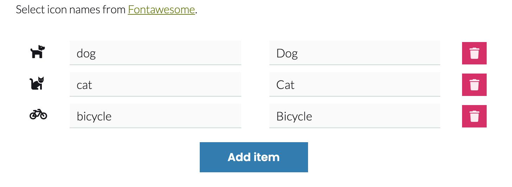

# volto-vocabulary-icons-widget

Volto addon for vocabularies with icons

Install with mrs-developer (see [Volto docs](https://docs.voltocms.com/customizing/add-ons/)) or with:

```bash
yarn add volto-vocabulary-icons-widget
```

## Features

This addon will add in your project the Widget to edit vocabularies where term key is associated with a Fontawesome icon.



## Usage

`Document your addon here`
